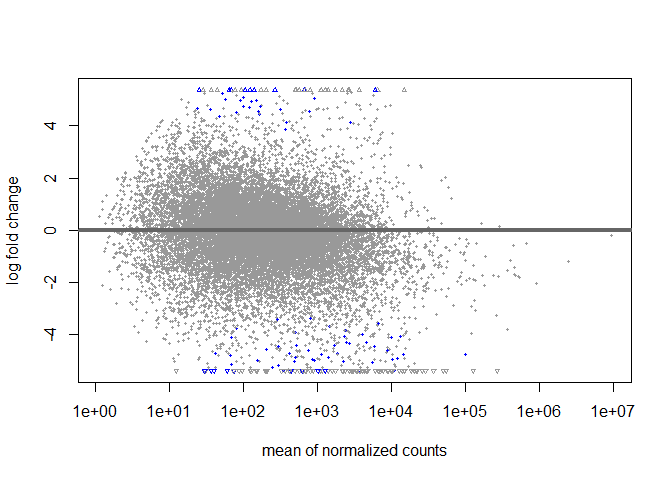
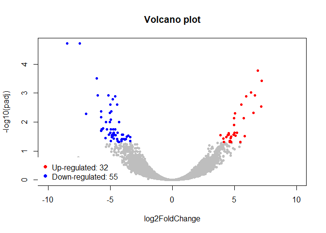
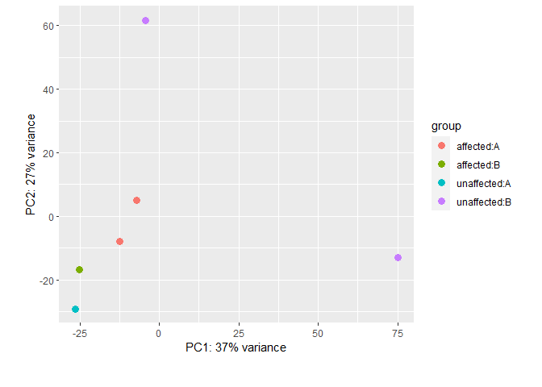

Tutorial of DESeq2 for Beginners
================
Ki Wook LEE
2022-11-18

- This page is for beginners of bioinformatics to understand basic
  analysis of RNA sequencing data using DESeq2.
- I wrote it by referring to official DESeq2 analysis workflow page
  (<http://bioconductor.org/packages/devel/bioc/vignettes/DESeq2/inst/doc/DESeq2.html>)

<br/>

#### You need to use R script named ‘DESeq2_tutorial.R’

### 1. Basic information

- DESeq2 is a package of R and is for DEG analysis with expression count
  table from RNA sequencing.
- For DESeq2, we need to generate ‘DESeqDataset’ with raw count table
  (counts should be integers) and its metadata which contains the
  information of samples like condition, sample ID, batch and etc.

<br/>

#### (1) DESeq2 installation

``` r
if (!require("BiocManager", quietly = TRUE))
    install.packages("BiocManager")

if (!require("DESeq2", quietly = TRUE)){
  install.packages("DESeq2")
  library(DESeq2)} else{
      library(DESeq2)
    }
```

- ‘Bioconductor’ is a collection of R-based data, methods, and packages
  for bioinformatics and ‘BiocManager’ is a tool for management of
  libraries in bioconductor

<br/>

### 2. Run DESeq2 with count matrix data

- Normally, when we obtain the RNA sequencing data from a public
  dataset, Its format is a count table that contains the sample IDs in
  column, genes in row and expression values in the table.
- It is recommended that to use un-normalized raw counts.

#### (1) Load the data

``` r
library(openxlsx); library(DESeq2)

# For futher analysis, we will use the RNA sequencing data of Zebrafish in 'zebrafishRNASeq' library
if (!require('zebrafishRNASeq', quietly = TRUE)){
  BiocManager::install("zebrafishRNASeq")
  library(zebrafishRNASeq)}else{
    library(zebrafishRNASeq)
  }

data(zfGenes)
```

|                    | Ctl1 | Ctl3 | Ctl5 | Trt9 | Trt11 | Trt13 |
|:-------------------|-----:|-----:|-----:|-----:|------:|------:|
| ENSDARG00000000001 |  304 |  129 |  339 |  102 |    16 |   617 |
| ENSDARG00000000002 |  605 |  637 |  406 |   82 |   230 |  1245 |
| ENSDARG00000000018 |  391 |  235 |  217 |  554 |   451 |   565 |
| ENSDARG00000000019 | 2979 | 4729 | 7002 | 7309 |  9395 |  3349 |
| ENSDARG00000000068 |   89 |  356 |   41 |  149 |    45 |    44 |
| ENSDARG00000000069 |  312 |  184 |  844 |  269 |   513 |   243 |

<center>
**This table is consisted of 6 columns (samples) x 32561 rows (genes).**
</center>

<br/>

#### (2) Make an artificial metadata

- Now, let’s make an artificial metadata to practice. You can also make
  them with ‘excel’ and load with ‘openxlsx::read.xlsx()’ function.

``` r
metadata_mat=data.frame(Sample = colnames(zfGenes),
                    Condition = c(rep('affected',3), rep('unaffected',3)),
                    Batch = c('A','A','B','B','B','A'),
                    Seq.date = rep('22.11.15',6),
                    Seq.platform = rep('HiSeq4000',6))
```

| Sample | Condition  | Batch | Seq.date | Seq.platform |
|:-------|:-----------|:------|:---------|:-------------|
| Ctl1   | affected   | A     | 22.11.15 | HiSeq4000    |
| Ctl3   | affected   | A     | 22.11.15 | HiSeq4000    |
| Ctl5   | affected   | B     | 22.11.15 | HiSeq4000    |
| Trt9   | unaffected | B     | 22.11.15 | HiSeq4000    |
| Trt11  | unaffected | B     | 22.11.15 | HiSeq4000    |
| Trt13  | unaffected | A     | 22.11.15 | HiSeq4000    |

<br/>

#### (3) Run DESeq2

- It’s ready to make a DESeqDataset with our data.

``` r
## Make a DeseqDataset from matrix
dds_mat = DESeqDataSetFromMatrix(countData = zfGenes,
                                 colData = metadata_mat,
                                 design = ~ Condition)
```

    ## Warning in DESeqDataSet(se, design = design, ignoreRank): some variables in
    ## design formula are characters, converting to factors

``` r
## Pre-filtering
dds_mat = dds_mat[apply(counts(dds_mat),1,function(x) sum(x == 0)) < ncol(dds_mat) / 3,]
dim(dds_mat)
```

    ## [1] 19148     6

``` r
## specify the reference level
dds_mat$Condition = relevel(dds_mat$Condition,ref = 'unaffected')
dds_mat$Condition
```

    ## [1] affected   affected   affected   unaffected unaffected unaffected
    ## Levels: unaffected affected

<br/> \* Simply run DESeq2 with DESeq()

``` r
## Run DESeq2 
dds_mat = DESeq(dds_mat)

## Show the statistical characteristics
res_mat = results(dds_mat, alpha=0.05)
vsd_mat = vst(dds_mat,blind = F)
```

``` r
summary(res_mat)
```

    ## 
    ## out of 19148 with nonzero total read count
    ## adjusted p-value < 0.05
    ## LFC > 0 (up)       : 32, 0.17%
    ## LFC < 0 (down)     : 55, 0.29%
    ## outliers [1]       : 1091, 5.7%
    ## low counts [2]     : 1483, 7.7%
    ## (mean count < 14)
    ## [1] see 'cooksCutoff' argument of ?results
    ## [2] see 'independentFiltering' argument of ?results

- Variance stabilizing transformation (VST) is to remove the dependence
  of the variance on the mean, particulary the high variance of the
  logarithm of count data when the mean is low. It is used for the
  replacement of to take a logarithm with adding some small value to
  avoid becoming zero in a log

<br/>

#### (4) Save the result

- You can save your data with normalized count table

``` r
## Write the result 
out_mat = cbind(counts(dds_mat,normalized=T),res_mat)
write.xlsx(out_mat,'DESeq2 result from matrix.xlsx')
```

<br/>

### 3. Run DESeq2 with SALMON quantification result data

- Sometimes, we need to analyze the raw data (.fastq) from public
  dataset in a various purposes. SALMON is a quantification tool for RNA
  sequencing data and generates the result with .sf file.
- In this page, we will use 6 samples from ‘PRJNA855953’

#### (1) Make an transcriptome database from used .GFF file

- Before start, you need to download it from ENSEMBL database
  <https://ftp.ensembl.org/pub/release-106/gtf/homo_sapiens/>

``` r
library(tximport); library(readr); library(GenomicFeatures); library(openxlsx)
txdb = makeTxDbfromGFF("Homo_sapiens.GRCh38.106.chr.gtf")
k=keys(txdb, keytype = 'TXNAME')
tx2gene= select(txdb,k,"GENEID",'TXNAME')
```

#### (2) Load the metadata

``` r
## load the metadata
metadata_txi=read.xlsx('metadata.xlsx')
```

| sample      | Condition | quant_file                  |
|:------------|:----------|:----------------------------|
| A549_WTOE_1 | WT_OE     | SALMON/A549_WTOE_1/quant.sf |
| A549_WTOE_2 | WT_OE     | SALMON/A549_WTOE_2/quant.sf |
| A549_WTOE_3 | WT_OE     | SALMON/A549_WTOE_3/quant.sf |
| A549_T\_1   | KEAP1_lof | SALMON/A549_T\_1/quant.sf   |
| A549_T\_2   | KEAP1_lof | SALMON/A549_T\_2/quant.sf   |
| A549_T\_3   | KEAP1_lof | SALMON/A549_T\_3/quant.sf   |

#### (3) make a DESeqdataset from tximport

``` r
## Tximport with result files of SALMON (quant.sf)
txi=tximport(metadata_txi$quant_file,type="salmon",tx2gene=tx2gene,countsFromAbundance ="no",ignoreTxVersion = T)

colnames(txi$counts)=metaData$Sample
head(txi$counts)

## Make a DeseqDataset from matrix
dds_mat = DESeqDataSetFromTximport(txi = txi,
                                   colData = metadata_txi,
                                   design = ~ Condition)
```

\*For about ‘CountsFromAbundance’, there are 3 options “no”, “TPM”, and
“scaledTPM”. It is that ‘Tximport’ can normalize with its own method. If
you want to normalize with other method, you need to use ‘no’.

<br>

#### \* Next steps are exactly same with DESeq2

<br>

### 4. Make some plots to analyze

``` r
library(ggplot2); library(grid); library(gridBase); library(ggrepel); library(calibrate)

x11()             ## Open plot window
par(mfrow=c(2,2)) ## Divide the plot window by 4
```

<br/>

``` r
## MA plot
plotMA(res_mat)
```

<!-- -->

``` r
## Count comparison plot
plotCounts(dds_mat,gene=which.min(res_mat$padj),intgroup='Condition') # You can select the gene with its name (ex. gene= 'ENSDARG0000000001')
```


``` r
## Volcano plot 
with(res_mat, plot(log2FoldChange, -log10(padj), pch=20, main="Volcano plot", xlim=c(-10,10),col='gray'))
with(subset(res_mat, padj<0.05 ), points(log2FoldChange, -log10(padj), pch=20,))
with(subset(res_mat, padj<0.05 & log2FoldChange>=1.0),points(log2FoldChange, -log10(padj), pch=20, col="red"))
with(subset(res_mat, padj<0.05 & log2FoldChange<=-1.0),points(log2FoldChange, -log10(padj), pch=20, col="blue"))
legend("bottomleft",legend=c(paste0("Up-regulated: ",length(rownames(subset(res_mat, padj<0.05 & log2FoldChange>=1.0)))),
                             paste0("Down-regulated: ",length(rownames(subset(res_mat, padj<0.05 & log2FoldChange<=-1.0))))),
       col=c("red","blue"),pch=19,border="white",box.lty=0,cex=1)
```

<!-- -->

``` r
### PCA plot
p1 = plotPCA(vsd_mat,intgroup=c('Condition','Batch'))

####do not change below lines, just run them
plot.new()
vps = baseViewports()
pushViewport(vps$figure)
vp1 = plotViewport(c(1.8,1,0,1))
print(p1,vp=vp1) 
```

<!-- -->
